# 📱 UG Map App

A campus-specialized mobile application built with React Native to help University of Ghana students, faculty, and staff navigate campus life more easily.

## 🚀 Features

- Smart Campus Map with location pins and accessibility
- Event Listings and RSVP
- Community Notice Board (Lost & Found, Buy/Sell, Clubs)
- Services Finder (Wi-Fi zones, ATMs, Support centers)
- Push Notifications for urgent messages and reminders

# ✅ Minimum Viable Products (MVPs) – UGMap

A breakdown of core features required for the first functional release of UGMap.

---

## 🧭 1. User Authentication
- Email & password login
- Google/Microsoft SSO integration
- Forgot password/reset system
- Secure user session management

---

## 🏠 2. Home Screen
- Welcome back message
- Search bar for quick access
- Featured events or notices
- Mini campus map preview
- Notification bell icon

---

## 🗺️ 3. Campus Smart Map
- Interactive campus map
- Show current GPS location
- Pin categories (Hostels, Lecture Halls, Cafeterias, Offices)
- Indoor navigation basic support
- Offline map support (basic caching)

---

## 🧰 4. Find Services
- List of campus services (ICT, ATMs, Wi-Fi zones, etc.)
- Filter and search functionality
- Service detail pages (location, contact, hours)

---

## 📅 5. Events & Programs
- Upcoming events list
- Event details (time, venue, description)
- RSVP and reminders

---

## 👥 6. Profile Management
- Edit profile (name, profile picture)
- Notification preferences
- User-specific data (e.g., RSVP’d events)

---

## 🛎️ 7. Push Notifications
-  Campus-wide announcements
-  Emergency alerts (drills, closures)
- Event and reminder notifications

---

## ♿ 8. Accessibility Support
- High contrast UI option
- Mark wheelchair accessible routes (planning ready)

---

> 💡 These MVPs ensure UGMap is useful, intuitive, and ready for deployment or classroom demo.

## UI Designs
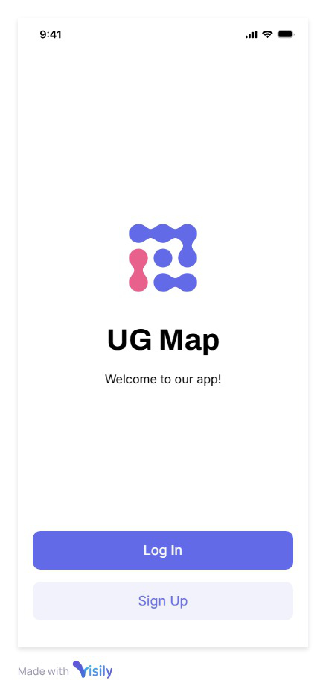 
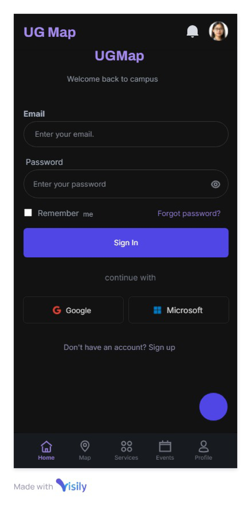
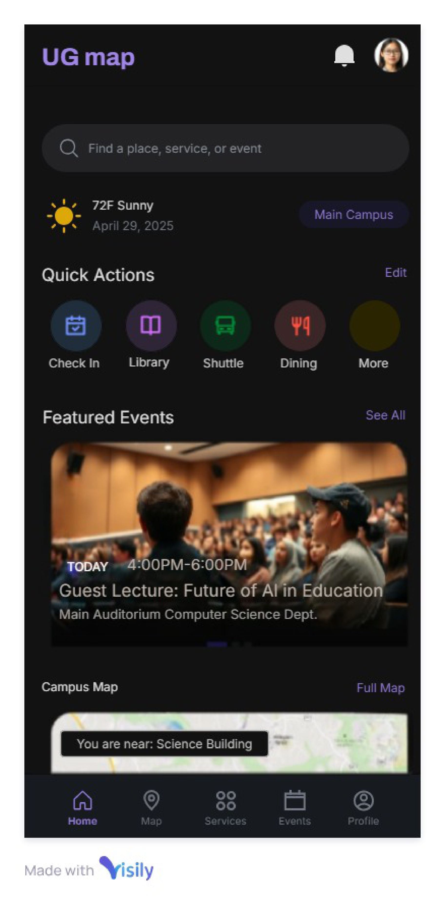
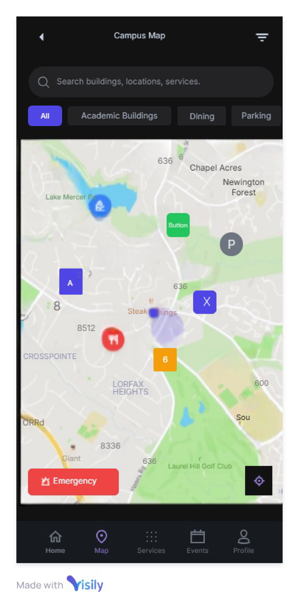

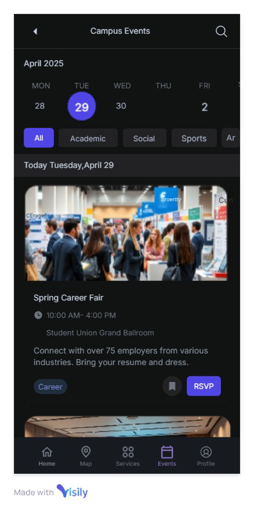
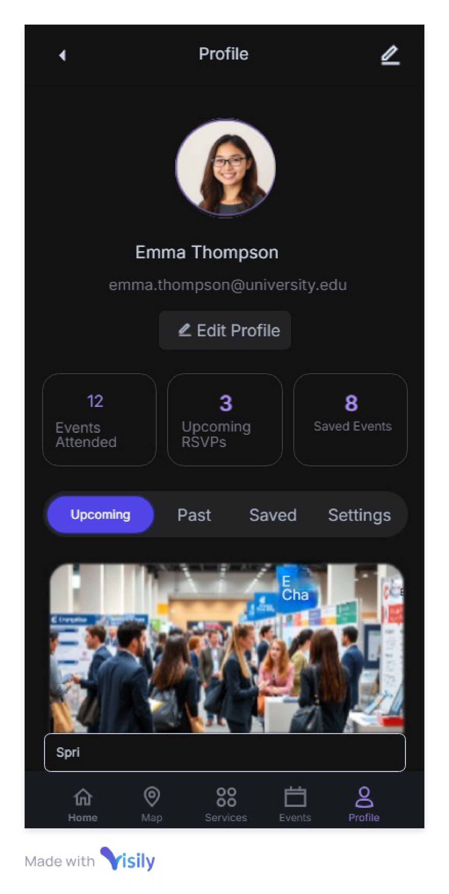
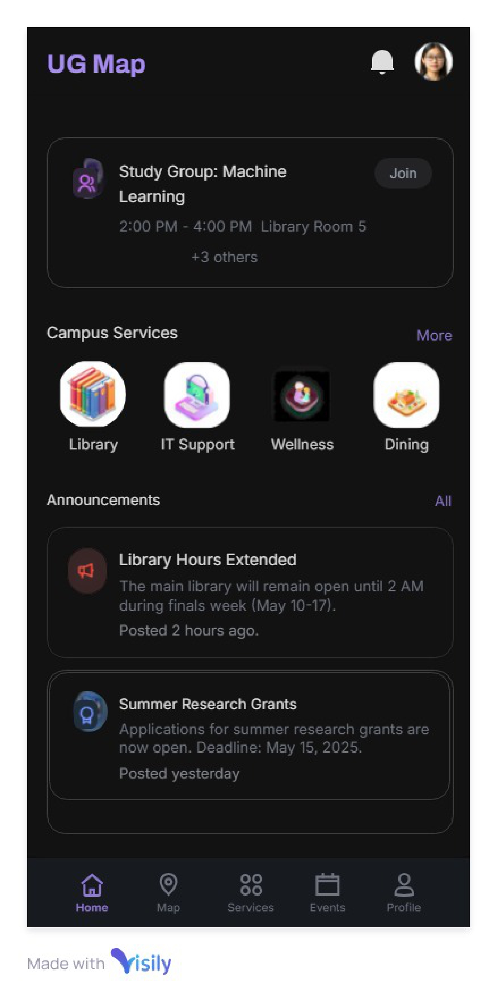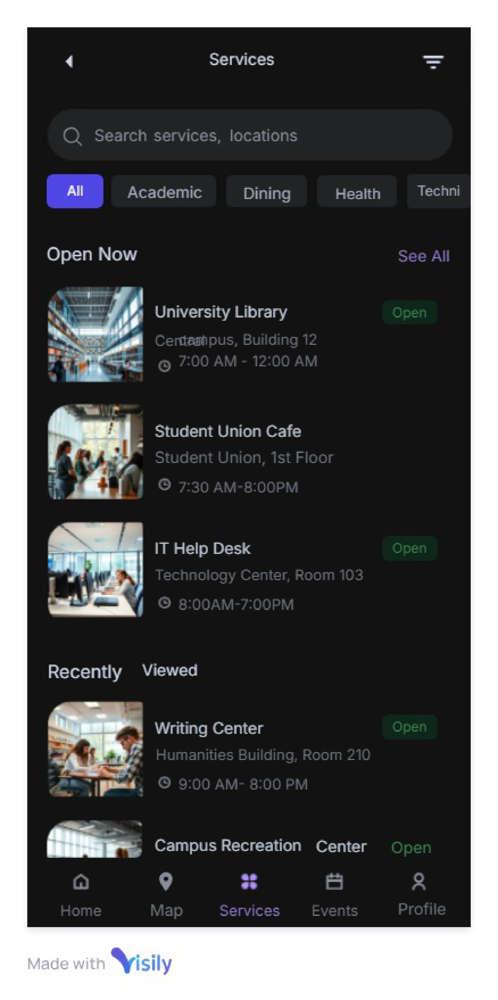
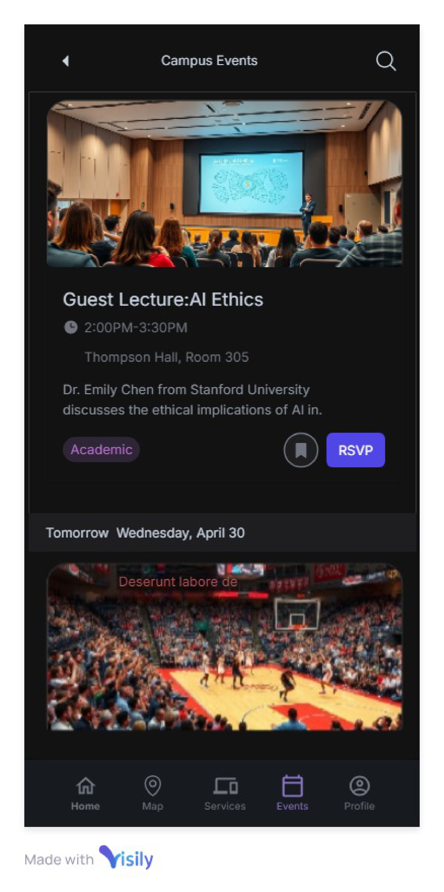
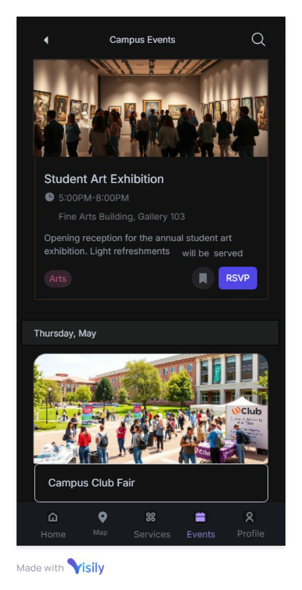
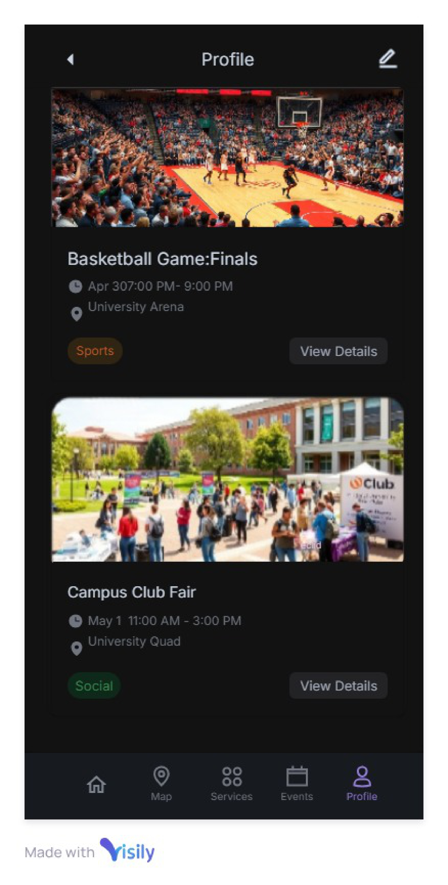

## 🛠️ Tech Stack

- Frontend: React Native + Expo
- Backend: Firebase (Auth + Firestore)
- Map Services: Mapbox / Google Maps SDK
- Notifications: Expo or Firebase Cloud Messaging
- Auth: Firebase Email-based

## 👥 Contributors
Frederick Kwaku Kankam - Lead

Moses Ampadu

Fauzia Al-Hassan